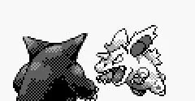
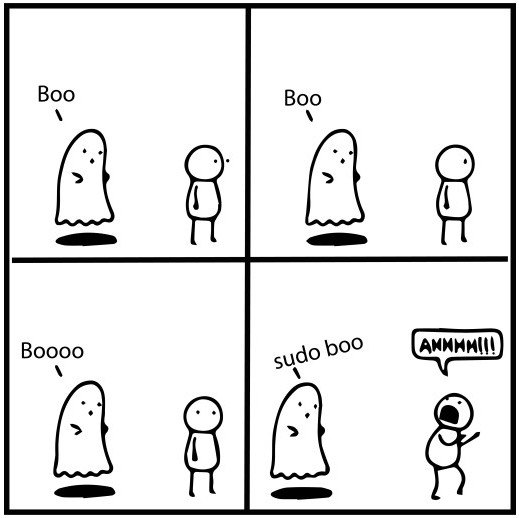

*Warnings*

Para la realización de esta actividad voy a tener los siguientes supuestos:
+ Eres capaz de leer y entender oraciones **largas** y eres capaz de comprender **lo que hay que hacer**.
+ Eres capaz de manejar rutas relativas y absolutas con precisión y te tomas en serio la actividad. Si no realizas las rutas correctamente, no voy a hacer mi trabajo *(tendrás un 0 en el apartado)*
+ Cada actividad va a ser corregida de forma *individual* y separada del resto de actividades.
+ Soy consciente de que estamos tratando retos que no hemos trabajado en profundidad en clase, por ello mismo no tengáis miedo en hacer preguntas.
+ Cuando hagáis comandos, recomiendo encarecidamente apuntarlos puesto que serán relevantes más adelante.
+ Si alguien realiza algún tipo de *trampa* o *plagio* lo sabré.

Enfrentamientos Pokemon
========================

# Configuración inicial

Vamos a crear un simulador de peleas Pokemon.

<center>



</center>
Crea una nueva máquina virtual usando Ubuntu con la versión 25.04 en NAT.

## Tarea 1

Configura la conexión a internet de la máquina para que utilice la IP dinámica.

## Tarea 2

Crea un usuario que actuará como administrador.

|Usuario | Contraseña |
|:-:|:-:|
|Pokemaster|tsebyreveht|

## Tarea 3

Una vez definido el usuario hay que crear los Pokemon que se tendrán que enfrentar entre si. Para ello vamos a crear varios usuarios, siendo cada uno de ellos un Pokemon distinto, y varios grupos, indicando los tipos que tienen.

Crea varios usuarios en el sistema de forma *desatendida*. Para ello tendréis que crear un script.

|Usuario | Contraseña |
|:-:|:-:|
|Ivysaur|0002|
|Charizard|0006|
|Vileplume|0045|
|Arcanine|0059|
|Slowbro|0080|
|Lapras|0131|

Adicionalmente tendréis que crear varios grupos e introducir a los distintos Pokemon

* Planta (Ivysaur y Vileplume)
* Fuego (Charizard y Arcanine)
* Agua (Slowbro y Lapras)

## Tarea 3.5

Intenta acceder a cada uno de los usuarios.

## Tarea 4

Ahora hay que representar cada Pokemon, para ello vamos a crear varios ficheros en su directorio `home` para indicar sus estadísticas.

* `vida.txt`
* `ataque.txt`
* `defensa.txt`
* `velocidad.txt`

Estos ficheros contendrán los datos para hacer la simulación de cada combate. Os dejo un ejemplo para ver como se haría.

```bash
#!/bin/bash 
echo " Zubat " 
echo " ----- "
echo "400" > /home/zubat/vida.txt 
echo "90" > /home/zubat/ataque.txt 
echo "80" > /home/zubat/defensa.txt 
echo "130" > /home/zubat/velocidad.txt 
chown zubat:zubat /home/zubat/*.txt 
exit 0
```

Todos los ficheros deberán tener al Pokemon como usuario y grupo.

Este script unicamente puede ser ejecutado por un usuarios con permisos de administrador del sistema.

## Tarea 5

Crea una función que reciba un usuario como parámetro e indique a que grupos **NO** pertenece el usuario.

# Simulador 1.0

De momento vamos a crear una primera versión. Por supuesto la primera versión es muy básica, asi que tendremos que hacer muchas mejoras a futuro.

## Permisos

* El script de pelea únicamente puede ser ejecutado por un usuario con permisos de Administrador. Si no tiene esos permisos no podrá ser ejecutado.




* El script de pelea debe aceptar solo 2 argumentos.

* Los argumentos deben de ser usuarios válidos del sistema.

* Para cada usuario, el script deberá validar si tiene todos los ficheros disponibles y si tienen permisos de lectura.

## Comienzo y fin del combate.

Para cada Pokemon hay que cargar sus estadísticas para prepararlo para el combate. Siempre el Pokemon con la estadística de velocidad más alta actuará primero.

En el final de cada combate todos los Pokemon deberán volver a sus estadísticas originales.

## Combate

Mientras ambos Pokemon continúen con vida se irán turnando los ataques.

Para atacar usaremos la siguiente fórmula.

$Daño = ((\$random \times Ataque)RoundedDown) - Defensa$

Aquí tendremos que generar un número aleatorio entre 0.75 y 1.25 para establecer la efectividad del ataque y luego lo multiplicaremos por el ataque y por último se lo reduciremos a la defensa.

Si el Ataque final es un número positivo quitamos la cantidad obtenida a la vida del Pokemon defensor.

Para cada una de las rondas el programa deberá mostrar lo siguiente:

### Pokemon atacante.
* Ataque
* Daño causado

### Pokemon defensor
* Defensa
* Daño antes del golpe
* Daño después del golpe

Además podréis mostrar toda la información adicional que creáis necesaria.

El combate continuará hasta que uno de los dos Pokemon tenga 0 puntos de vida.


## Simulador 1.1

Ahora vamos a implementar la tabla de tipo y los críticos.

Seguiremos esta estructura. Si no aparece la pareja en la tabla supondremos que tiene un Bonus de x1.

|Tipo atacante|Tipo defensor|Bonus de Daño|
|:-:|:-:|:-:|
|Fuego|Planta|x2|
|Fuego |Agua|x0.5|
|Planta|Agua|x2|
|Planta |Fuego|x0.5|
|Agua|Fuego|x2|
|Agua|Planta|x0.5|

También generaremos un número aleatorio antes de cada ataque para comprobar si es crítico o no.

$CritRate = 0.05\%$

$CritBonus = \times 2$

Con todo esto nos quedaría la siguiente fórmula:

$Daño = (((\$random \times Ataque \times Bonus) RoundedDown)\times CritBonus) - Defensa$

## Simulador 1.2

Debes mostrar el ganador del combate y el número de rondas.

# Simulador 2.0

Para esta versión vamos a conseguir dos funcionalidades nuevas:

* Todos los Pokemon van a tener un ataque especial que hace más daño.
* Vamos a incluir un [Easter Egg](https://es.wikipedia.org/wiki/Huevo_de_Pascua_(virtual)) (Huevo de Pascua) en el juego.

## Nuevo tipo

Primero incluye los tipos Psíquico y Veneno y un nuevo Pokemon: Alakazam.

|Usuario | Contraseña |
|:-:|:-:|
|Alakazam|0065|

Añade Ivysaur y Vileplume al grupo Veneno y Alakazam y Slowbro al tipo Psíquico.

Sobre los nuevos tipos, Psíquico es fuerte contra veneno (x2) y resistente contra si mismo unicamente (x0.5)


## Nuevo ataque

En el caso de Ivysaur, Vileplume y Slowbro podemos ver que pertenecen a dos grupos.

Vamos a suponer que los Pokemon son inteligentes asi que van a usar el tipo que mejor les convenga para cada situación.

### Ataque

En el caso de que sea atacante, revisaremos que **Bonus** de daño es mayor.

**Ejemplo**

*Slowbro vs Ivysaur*

* Slowbro tiene el tipo Agua (x0.5) y el tipo Psíquico (x2) así que su bonus será un x2

*Slowbro vs Alakazam*

* Slowbro tiene el tipo Agua (x1) y el tipo Psíquico (x0.5) así que su bonus será un x1

## Simulador 2.1

Ahora vamos a implementar el ataque especial.

Tendremos que crear un fichero `especial.txt` el cual contendrá el valor 0. Si el Pokemon recibe un ataque y no le hace daño, almacenará la diferencia en el fichero.

**Ejemplo**

* Ataque: 50, Defensa: 60, Daño: 0

En este caso guardaríamos 60-50 en el fichero, es decir 10.

Cuando realicemos un ataque, si el valor del fichero `especial.txt` es 100 multiplicaremos x1,5 el ataque.

## Simulador 2.2 

Ahora vamos a implementar el Easter Egg.

Si el ataque que hace un Pokemon hace 777 de daño, en su lugar causará 777777 de daño y saldrá un mensaje especial.

**Ejemplo**

* Ataque: 797, Defensa: 20, Daño 777.
  + El ataque ha causado 777777 de daño, ¡que suerte!


# Simulador 3.0

Ya tenemos la funcionalidad definida del combate, pero el tipo Psíquico es demasiado fuerte, añade el tipo Bicho con Metapod como Pokemon

|Usuario | Contraseña |
|:-:|:-:|
|Metapod|0011|

El tipo Bicho añade los siguientes cambios.

|Atacante|Defensor|Bonus|
|:-:|:-:|:-:|
|Fuego|Bicho|x2|
|Planta|Bicho|x0.5|
|Veneno|Bicho|x0.5|
|Planta|Bicho|x0.5|
|Bicho|Planta|x2|
|Bicho|Veneno|x0.5|
|Bicho|Fuego|x0.5|
|Bicho|Psíquico|x2|

En este caso si el Pokemon defensor tiene 2 tipos tendremos que multiplicar los bonuses de daño para calcular el bonus final.

**Ejemplo**

*Metapod vs Ivysaur*

Metapod es tipo Bicho (x2 contra planta y x0.5 contra veneno) asi que tendrá un Bonus de x1


## Simulador 3.1

Vamos a crear la posibilidad de debilitar Pokemon.

Ahora cuando se derrote un Pokemon, deberás borrar su usuario del sistema. De esta forma no podrá volver a combatir hasta que no se restablezca.

## Simulador 3.2

Para terminar, vamos a crear un script que simule un Centro Pokemon, es decir, un sitio para recuperar a los Pokemon debilitados.

Ahora cuando se restablezcan los Pokemon, se deberá crear cada uno de los usuarios que no existan, unirlos a los grupos correspondientes y crear los ficheros que correspondan, con todos los valores establecidos previamente para cada uno de ellos.


